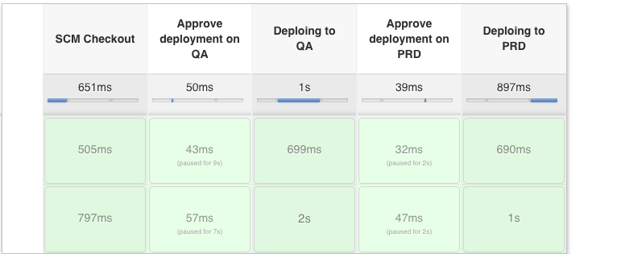

# Example usage of Travis for CI testing and Jenkins pipeline for deployment
[](https://travis-ci.org/achuchulev/jenkins-cicd-example)

## How it works

- On every commit/PR a travis test is initiated using inspec to check that site output match the expected one
- On every PR merge a jenkins build is triggered by a webhook and the following pipeline is triggered:



On stage:
```
    1 -> Fetching changes from the remote Git repository
    2 -> Approve Deploy to QA
    3 -> Website content is being applied on QA server
    4 -> Approve Deploy to PROD
    5 -> Website content is being applied on PROD server
```
